# LT-Spice Source Follower Simulations

## Large Signal

    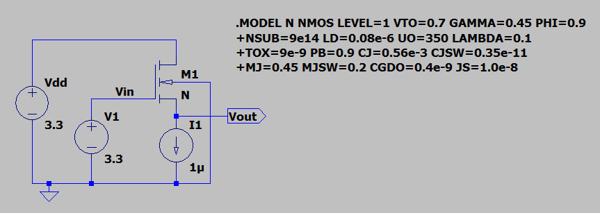

    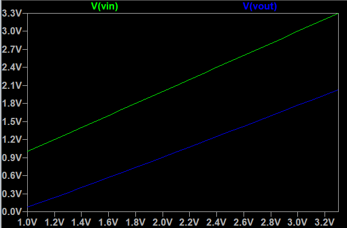

## Time Domain

    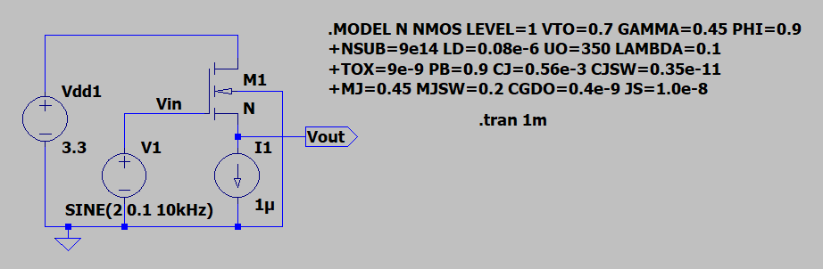

    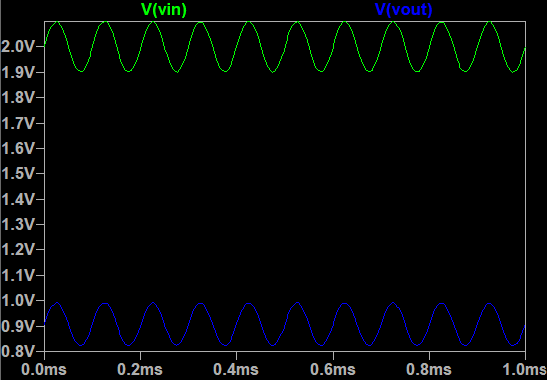

## Small Signal

    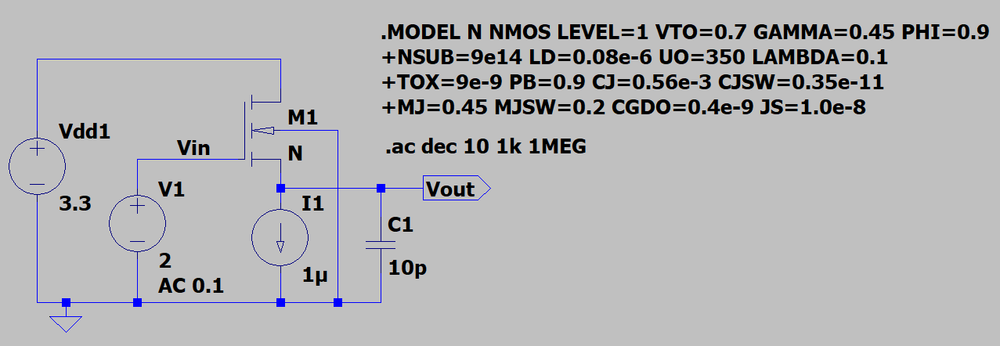

    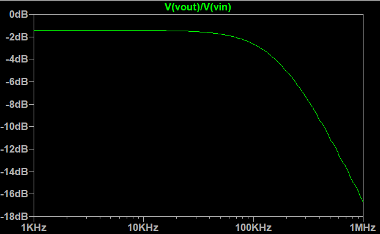

## Capacitive Load

    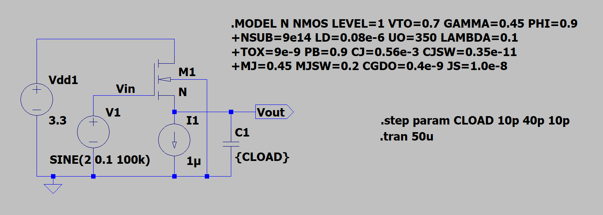

    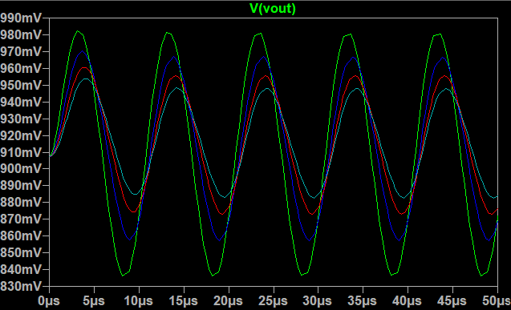

    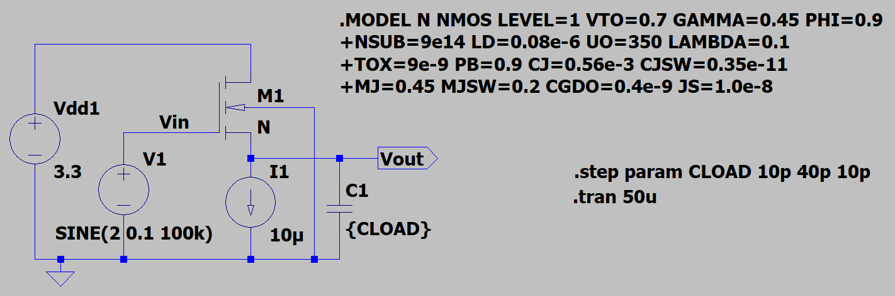

    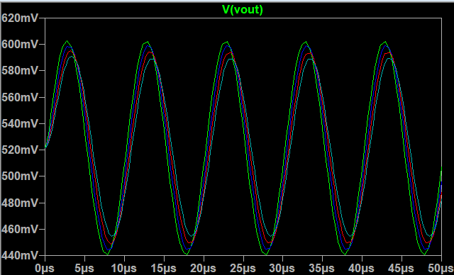

## Small Signal with larger current source

    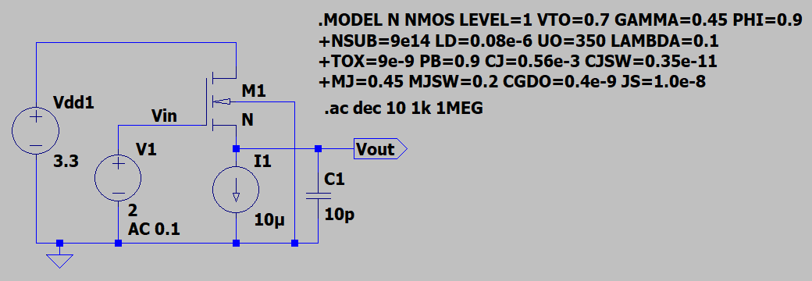

    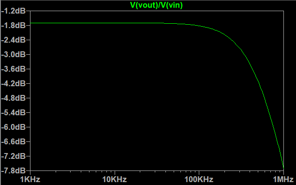

