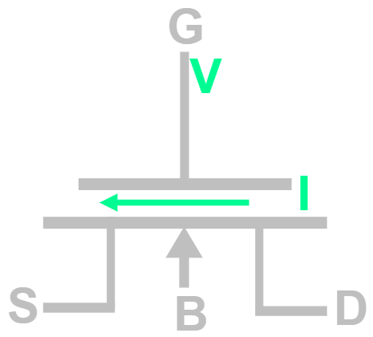
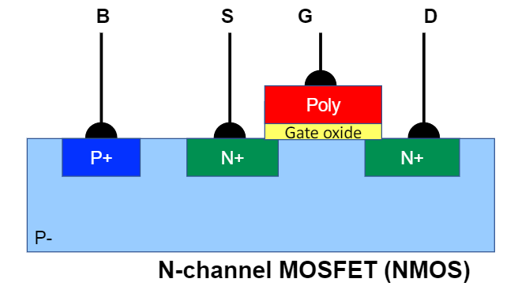
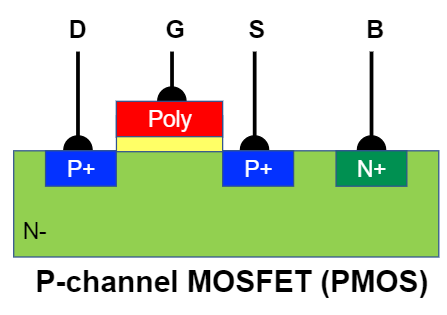
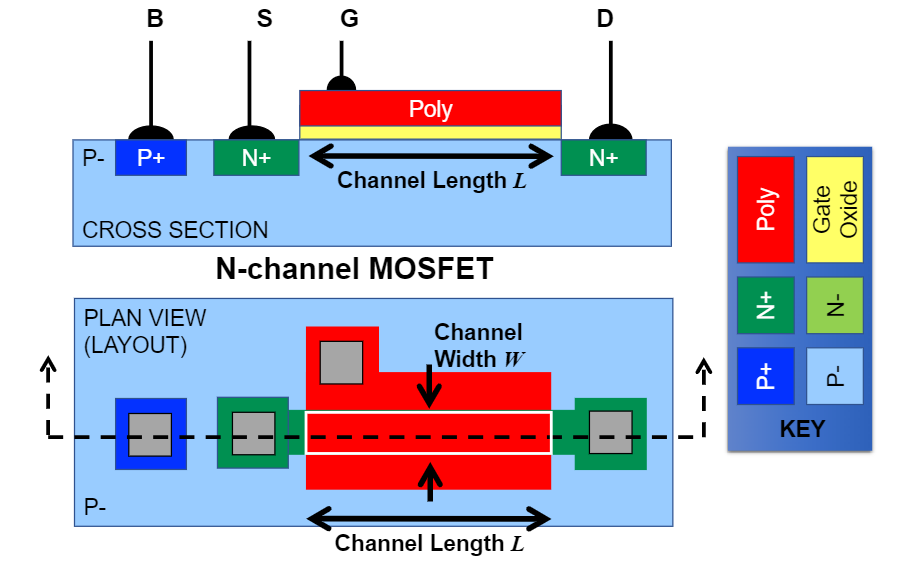
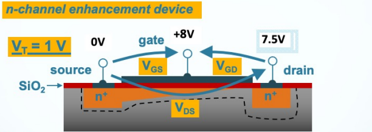
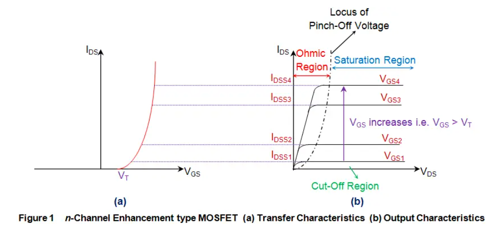
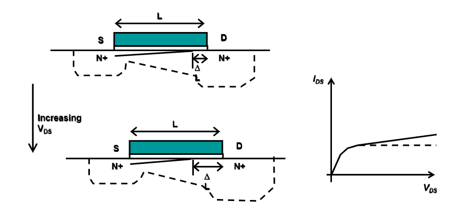
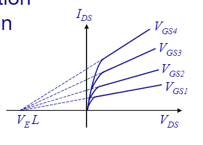
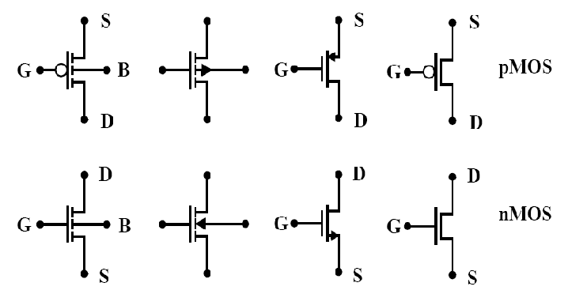

# Introduction to MOSFETs

MOSFET stands for Metal Oxide Semiconductor Field Effect Transistor

    

A MOSFET is a 4-terminal analogue switch. The voltage at the gate (G) controls the current flow between the drain (D) and the source (S). The body or bulk terminal (B) is part of the MOSFET substrate and influences the threshold voltage. This is often connected directly to the source by the MOSFET manufacturer.

>**Note:** If the bulk connection is not shown in a circuit diagram assume it is connected to the source

The following shows the internal structure of an N-channel MOSFET:

    

As you can see it resembles the structure of 2 back-to-back diodes. It is called N-channel as it has N-type semiconductors used as the source and drain terminal material. When switched on by applying a sufficient $V_{GS}$ voltage as the gate, a N-type channel of electrons forms below the gate, allowing current to flow between the source and drain terminals. The P-channel is the complement of the N-channel MOSFET:

    

>**Note:** The $+/-$ symbols (as in: P+/P-) refer to doping strength/concentration not charge

Important properties pertaining to the device functionality are the channel length $L$ and channel width $W$. These properties affect the device's behaviour and thus are often included in mathematical models describing operation:

    

## MOSFET Operation

The N-Channel MOSFET switches on allowing current to flow between the drain and the source $I_{DS}$ (can also be stated as $I_{D}$), when the gate voltage $V_{GS}$ is more than the threshold voltage $V_{TH}$.

$$
On: V_{GS} > V_{TH}
$$

$$
Off: Otherwise
$$

As, to simplify calculations we define the overdrive voltage as $V_{OD} = V_{GS} - V_{TH}$. Thus, the above operating conditions can be restated as:

$$
On: V_{OD} > 0
$$

$$
Off: Otherwise
$$

### Cutoff

When the N-channel MOSFET is switched off it is said to be operating in the cutoff region. The MOSFET at the circuit level appears as a very high impedance between the source and the drain, thus stopping current flow $I_{DS} = 0$.

### Linear

When the N-Channel MOSFET is switched on ($V_{GS} > V_{TH}$), if the voltage between the source and drain is small:

$$
V_{DS} < V_{GS} - V_{TH} = V_{OD}
$$

The MOSFET is said to be in the linear operating region, and thus follows the following linear relationship between the drain current and drain source voltage (output characteristics):

$$
I_{DS} = \mu_{n} C_{OX} \frac{W}{L} \left((V_{GS} - V_{TH}) - \frac{V_{DS}}{2} \right) V_{DS}
$$

As mentioned above, MOSFETs have process parameters related to their manufacture. It is thus useful to define a device characteristic parameter $\beta$ as:

$$
\beta = \frac{\mu_{n}C_{OX}W}{L} = k_{n}^{\prime} \frac{W}{L} \qquad k_{n}^{\prime} = \mu_{n} C_{OX}
$$

 >**Note:** Electrons have higher mobility than holes and thus $k_{n}^{\prime} \approx 2.5 \cdot k_{p}^{\prime}$. 

>**Note:** Process parameters are subject to manufacturing variation, thus, a major challenge in MOS circuit design is robustness in design with respect to these parameters

The above linear output characteristic equation can be simplified as:

$$
I_{DS} = \beta (V_{OD} V_{DS} - \frac{V_{DS}^{2}}{2})
$$

For $V_{DS} << V_{OD}$ this becomes:

$$
I_{DS} = \beta V_{OD} V_{DS}
$$

### Saturation Region

When the N-Channel MOSFET is switched on ($V_{GS} > V_{TH}$), if the voltage between the source and drain $V_{DS}$ is sufficiently large, saturation occurs. 

    

In this case the voltage between the gate and the substrate at the drain is smaller than the threshold voltage and thus the channel thickness becomes zero at that point. This phenomena is called "pinch-off":

$$
V_{GD} = V_{GS} - V_{DS} \le V_{TH}
$$

Therefore, saturation occurs when:

$$
V_{DS} \ge V_{GS} - V_{TH} = V_{OD}
$$

The MOSFET is said to be in the saturation operating region, and thus follows the following relationship drain current output characteristic relationship (constant with respect to the drain source voltage):

$$
I_{DS} = \frac{\beta}{2} V_{OD}^{2}
$$

Unfortunately, this is an approximation. In reality, as explained by [channel length modulation](#channel-length-modulation), further increases in drain source voltage $V_{DS}$ lead to a marginal increase in the drain source current $I_{DS}$.

## N-channel MOSFET operation characteristics

    

## Second Order Effects

### Channel Length Modulation

Under the [MOSFET saturation](#saturation-region) condition, the drain source current $I_{DS}$ is assumed to be constant (flat line). In reality, further increases in drain source voltage $V_{DS}$, past the pinch-off point, lead to a marginal increase in the drain source current $I_{DS}$. 

Increasing $V_{DS}$ causes the channel to shorten, and although the current is even though the current is dominated by the pinch-off region. The small reduction in channel length causes a small reduction is channel resistance and a corresponding marginal rise in drain source current $I_{DS}$. 

    

This effect is known as channel length modulation and is responsible for the Early Effect in MOSFETs. This effect can be included in the saturation region MOSFET drain current equation using a process parameter $\lambda$. This is dependant on the MOSFET length ($\lambda \propto \frac{1}{L}$) and type. The early voltage can be calculated as $V_{E} L$ where $V_{E}$ is a model fitting parameter with unit $\frac{V}{\mu m}$.

    

### Body Effect

As mentioned earlier, IC manufacturers tend to connect MOSFETs bulk/body to the source. This is primary to simplify the equations used to analyse operation and complexity of the device. This sets the threshold voltage at a steady known level/value. 

Considering an N-channel MOSFET. Applying a negative voltage to the bulk with respect to the source, causes the depletion region to grow. This in turn increases the threshold voltage. The bulk terminal can thus be used as an additional control similar to that of the gate. This effect is mathematically modelled by the following equation:

$$
V_{TH} = V_{TH0} + \gamma_{n}(\sqrt{\varphi_{n} + V_{SB}} - \sqrt{\varphi_{n}})
$$

As expected, when the bulk and source are connected the, the quation simplifies to $V_{TH0}$.

## MOSFET circuit symbols

    

## Summary

As the P-channel MOSFET is the dual of the N-channel MOSFET most of the equations are reversed. This can, however, be quite confusing. Thus, generalised equations that apply to both types of MOSFET are presented here.

The main control used to switch a MOSFET is the gate voltage which takes affect with reference to the source voltage $V_{GS}$. This determines the overdrive voltage $|V_{OD}| = |V_{GS}| - |V_{TH}|$ and thus controls the drain source current $I_{DS}$.

>**Note:** The above formula for $|V_{OD}|$ is a notational redefinition for correctness

the notation used above for the overdrive voltage is not strictly I have used 

The second control used with a MOSFET is the $V_{DS}$ voltage. This determines whether the MOSFET is operating in the linear or saturation region. $|V_{DS}| > |V_{GS}| - |V_{TH}| = |V_{OD}|$ implies saturation and $|V_{DS}| < |V_{GS}| - |V_{TH}| = |V_{OD}|$ implies linear.

The final (less frequent) control that can be used is the voltage between the bulk and the source $V_{BS}$. As per the [body effect](#body-effect) this can be used to control the threshold voltage $V_{TH}$.

## Additional Reading

Design of Analog CMOS integrated circuits ($1_{st}$ and $2_{nd}$ edition) - Sections $2.1 \to 2.3$
