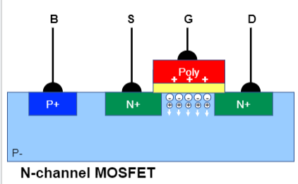
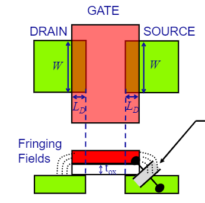
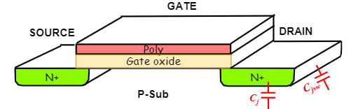
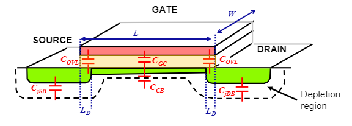
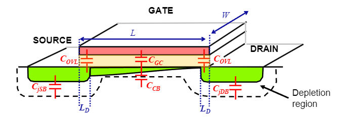
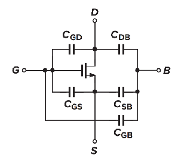
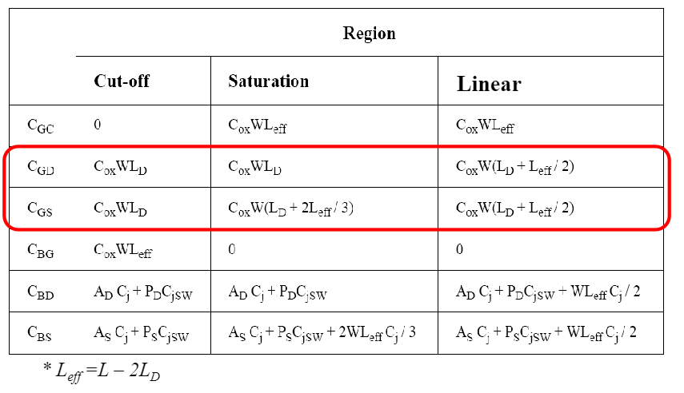

# MOSFET Capacitances

MOSFETs have a number of parasitic capacitances which are important for analysing the devices high frequency operation. These are dependant on the MOSFET's bias conditions and are thus analysed in relation to them.

## Oxide Capacitances

### Parallel-plate Gate Capacitance

In the cut-off MOSFET operating region, the gate poly material in a MOSFET acts as a plate in a capacitor. The other plate is the substrate and depletion layer (depending on bias) surrounded by the source and drain regions. These plates are split by the gate oxide (dielectric layer) creating the parallel-plate capacitor structure. 

    

As per the parallel-plate capacitor equation the this capacitance is:

$$
C_{GB} = \frac{\epsilon_{ox}}{t_{ox}} \cdot A = C_{ox} W L_{eff} \quad L_{eff} = L - 2L_{D}
$$

Where $t_{ox}$ is the oxide layer thickness, $A$ is the gate area, and $C_{ox}$ is a unifying parameter representing the gate oxide capacitance per unit area. The effective length of the gate oxide $L_{eff}$, where $L_{D}$ is the diffusion length inherent su to manufacturing, is used to improve the accuracy of this equation.

In the linear and saturation MOSFET operating regions the oxide capacitance is split between the gate drain and gate source capacitances. Thus we assume $C_{GB} = 0$ for the in these cases.

### Gate Overlap Capacitances

As mentioned above, in the manufacturing process the source and drain regions diffuse underneath the gate. Thus leading to overlap capacitances.

    

>**Note:** The overlap capacitance is present between the gate-source and the gate-drain overlaps although only one is shown above

Similarly, as with the [Parallel-plate Gate Capacitance](#parallel-plate-gate-capacitance), the overlap capacitance follows the equation:

$$
C_{OVL} = C_{ox} W L_{D}
$$

Here $L_{D}$ represents the length of source/drain side diffusion under the gate.

>**Note:** This equation is an approximation that omits fringe effects (more complex models are needed for precise calculation). The fringe effects lead to higher capacitive values.

## Junction Capacitances

Junction capacitances refer to the capacitances arising from the reverse-biased MOSFET P-N junctions. We divide this capacitance into two components. Capacitance from the bottom, modelled as $C_{j}$ (capacitance per unit area). Capacitance from the sidewalls, modelled as $C_{jsw}$ (capacitance per unit length). 

    

The junction capacitance exists in all MOSFET operation regions, and is non-linear in relation to the bias voltage. This capacitance is modelled using the equation:

$$
C_{j} = \frac{C_{j0}}{(1+\frac{V_{R}}{\phi_{B}})^{m}}
$$

$V_{R}$ is the reverse bias voltage placed across the junction (effectively $V_{SB}$). $C_{j0}$, $\phi_{B}$ the junction built-in potential and $m$ (typically 0.3 to 0.4) are process-related constants.

## Linear Region

Inversion occurs, and the conductive channel is formed acting as the bottom terminal of the [parallel-plate gate capacitance](#parallel-plate-gate-capacitance). 

    

As mentioned in the [parallel-plate gate capacitance](#parallel-plate-gate-capacitance) section, this capacitance is split between the source and drain. In this case, as the bias voltage is low $V_{DS} < V_{GS} - V_{TH}$, this is split equally between the source $C_{GS}$ and $C_{GD}$. In the linear region, the gate capacitances are thus:

$$
C_{GS} = C_{OVL} + \frac{1}{2} C_{ox} L W
$$

$$
C_{DS} = C_{OVL} + \frac{1}{2} C_{ox} L W
$$

## Saturation Region

In the saturation region, there is a varying electric field across the channel leading to pinch off:

    

As mentioned in the [parallel-plate gate capacitance](#parallel-plate-gate-capacitance) section, the gate capacitance is split between the source and drain. In this case, as the bias voltage is quite high $V_{DS} > V_{GS} - V_{TH}$, thus most of the oxide capacitance is seen with respect to the source. This is approximated as $\frac{2}{3}$ of $C_{GC}$ going to the source and 0 to the drain:

$$
C_{GS} = C_{OVL} + \frac{2}{3} C_{ox} L W
$$

$$
C_{DS} = C_{OVL}
$$

## Summary

As one may expect parasitic capacitance are present between every 2 of the 4 MOSFET terminals. 

    

The following table shows these:

    

In reality these are distributed capacitances, however, to allow for modelling they are lumped together. These capacitances are important for predicting MOSFET high-frequency behaviour. These calculations are performed automatically by modern electronic design automation (EDA) tools.

## Additional Reading

Design of Analog CMOS integrated circuits ($1_{st}$ and $2_{nd}$ edition) - Sections 2.4.1 to 2.4.2
