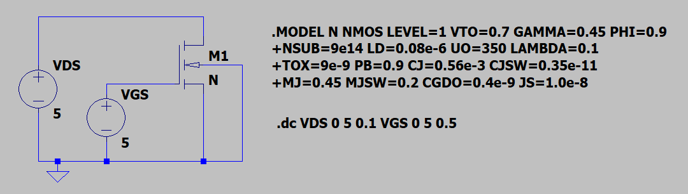
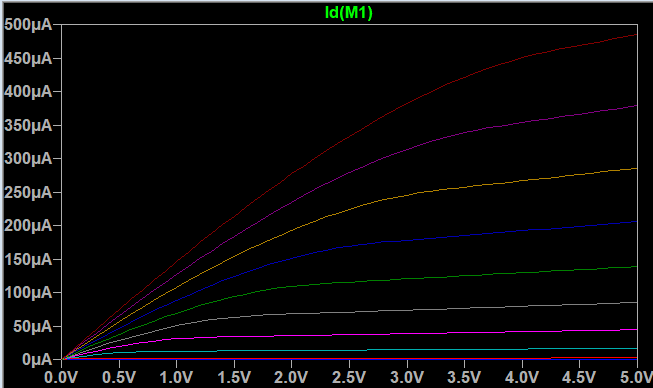
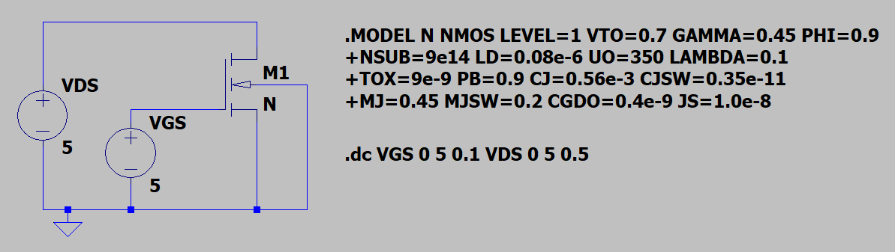
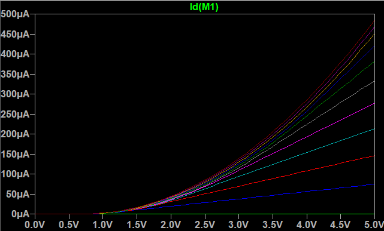
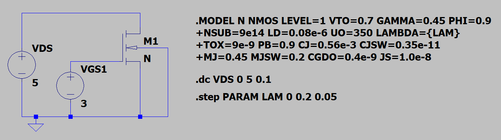
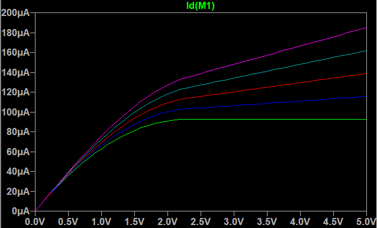
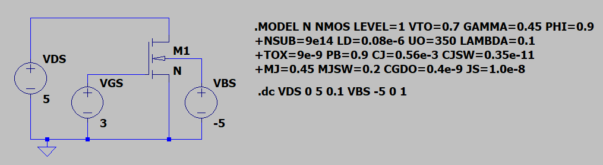
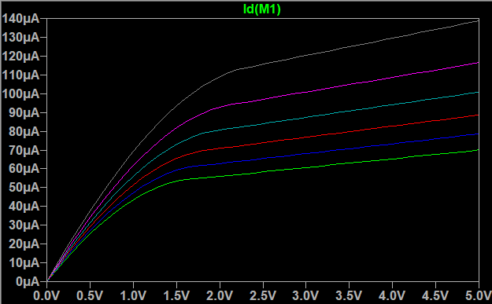
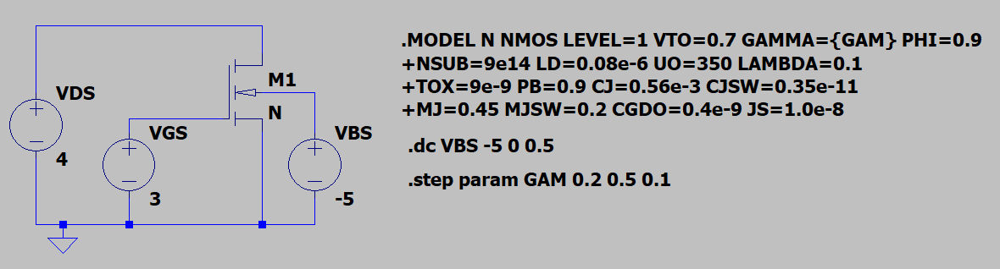
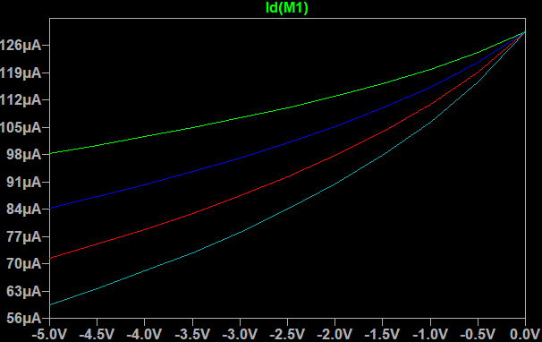

# LTSpice MOSFET Simulations 

To reinforce course knowledge LT-Spice simulations were conducted following the corresponding lectures and are, therefore, presented here. The LT-Spice simulation files can be found in this folder ending with `.asc`.

## Output Characteristics

The MOSFET output characteristic simulation was carried out using the following circuit:

<p align="center">
    
</p>

The simulation was carried out using the basic level 1, N-Channel MOSFET device model. This model represents a typical $0.5\mu m$ technology. The parameters in the model are:

VTO: threshold voltage with zero VSB (unit: $V$)

GAMMA: body-effect coefficient (unit: $\sqrt{V}$)

PHI: $2 \phi_{F}$ (unit: $V$)

TOX: gate-oxide thickness (unit: $m$)

NSUB: substrate doping (unit: $\frac{1}{{cm}^{3}}$)

LD: source/drain side diffusion (unit: $m$)

UO: channel mobility (unit: $\frac{cm^{2}}{Vs}$)

LAMBDA: channel-length modulation coefficient (unit: $\frac{1}{V}$)

CJ: source/drain bottom-plate junction capacitance per unit area (unit: $\frac{F}{m^{2}}$)

CJSW: source/drain sidewall junction capacitance per unit length (unit: $\frac{F}{m}$)

PB: source/drain junction built-in potential (unit: $V$)

MJ: exponent in CJ equation (unitless)

MJSW: exponent in CJSW equation (unitless)

CGDO: gate-drain overlap capacitance per unit width (unit: $\frac{F}{m}$)

CGSO: gate-source overlap capacitance per unit width (unit: $\frac{F}{m}$)

JS: source/drain leakage current per unit area (unit: $\frac{A}{m^{2}}$)


To perform a DC analysis, sweeping VDS from $0V$ to $5V$ in increments of $0.1V$, and sweeping VGS from 0V to 5V in 0.5V increments the following LT-Spice directive is used:

```
.dc VDS 0 5 0.1 VGS 0 5 0.5
```

The simulation produces a graph of $V_{DS}$ (x-axis) vs $I_{DS}$ (y-axis) with vertically increasing lines as $V_{GS}$ increases:

<p align="center">
    
</p>


## Transfer Characteristic

We now wish to observe the MOSFET transfer characteristic. The transfer characteristic is the effect of $V_{GS}$ on $I_{DS}$. We thus modify the previous simulation to use the following LT-Spice directive:

```
.dc VGS 0 5 0.1 VDS 0 5 0.5
```

The simulation circuit is now:

<p align="center">
    
</p>

Simulating this circuit in LT-Spice produces a graph of $V_{GS}$ (x-axis) vs $I_{DS}$ (y-axis) with vertically increasing lines as $V_{DS}$ increases:

<p align="center">
    
</p>

The threshold voltage is approximately $1V$ as defined in the model parameters.


## Channel Length Modulation

In this simulation, we attempt to observe the effects of channel-length modulation. This is approximated in our equations using the coefficient $\lambda$, and effect the variation of $I_{DS}$ with respect to $V_{DS}$. The level 1 LT-Spice model accounts for second-order effects such as channel length modulation, through the use of the parameter LAMBDA.

To produce a graph representing the effect of channel length modulation we choose a value for $V_{GS}$ in this case $3V$. We wish to perform a simulation similar to that of the output characteristic. We sweep the value of VDS from $0V$ to $5V$ with steps of $0.1V$ using the directive:

```
.dc VDS 0 5 0.1
```

We also wish to sweep the parameter lambda from $\lambda=0$ to $\lambda=0.2$ using steps of $0.05$. This is done using the following LT-Spice directive:

```
.step param LAM 0 0.2 0.05
```

The simulation circuit is thus:

<p align="center">
    
</p>

Simulating this circuit in LT-Spice produces a graph of $V_{DS}$ (x-axis) vs $I_{DS}$ (y-axis) with vertically increasing lines as $\lambda$ increases:

<p align="center">
    
</p>

Clearly, increasing the value of $\lambda$ increases the saturation region gradient of the output characteristic graph. Thus, the higher $\lambda$ a MOSFET has the less ideal of a current source it would be.

## Body Effect

Throughout our investigations so far we have connected the bulk to ground. This is, however, not always the case and results in what is known as the bulk effect. Connecting the bulk to a negative potential with respect to the source effectively increases the threshold voltage for the device.

To investigate this effect we once again set $V_{GS} = 3V$. We will sweep VDS as before from $0V$ to $5V$ by steps of $0.1V$. Instead of connecting the bulk directly to ground we will now replace that connection with a voltage source VBS. We will now sweep this source from $-5V$ to $0V$ in steps of $1V$ to observe the increasing threshold. This setup is achieved using the following directive:

```
.dc VDS 0 5 0.1 VBS -5 0 1
```

The test circuit is thus:

<p align="center">
    
</p>

Simulating this circuit in LT-Spice produces a graph of $V_{DS}$ (x-axis) vs $I_{DS}$ (y-axis) with vertically decreasing lines as $V_{BS}$ decreases (more negative with respect to source):

<p align="center">
    
</p>

As visible in the graph, decreasing $V_{BS}$ increases $V_{TH}$. This reduces the overdrive voltage $|V_{OD}| = |V_{GS}| - |V_{TH}|$, thus appearing as a lower line on the graph. This could be mistaken for decreasing $V_{GS}$.

## $\gamma$ - Body Effect

We wish to investigate the effect of the parameter $\gamma$ on the threshold voltage $V_{TH}$ and thus the output current $I_{DS}$. We will graph $V_{BS}$ (x-axis) against $I_{DS}$ (y-axis). As seen in the previous section ([body effect](#body-effect)) increasing $V_{BS}$ results in lowering the threshold voltage and thus an increase in drain current $I_{DS}$. We set $V_{GS} = 0V$ and $V_{DS} = 4V$, and sweep $V_{BS}$ from $-5V$ to $0V$ in steps of $0.5V$ using the following directive:

```
.dc VBS -5 0 0.5
```

As shown in the [body effect](/Week1/IntroMOSFET.md#body-effect) equation:

$$
V_{TH} = V_{TH0} + \gamma_{n}(\sqrt{\varphi_{n} + V_{SB}} - \sqrt{\varphi_{n}})
$$

The threshold voltage $V_{TH}$ increases with an increase in the coefficient $\gamma$. Therefore we expect $I_{DS}$ to decrease with increasing $\gamma$. We will step $\gamma$ from $0.2\sqrt{V}$ to $0.5\sqrt{V}$ in steps of $0.1\sqrt{V}$ using the following directive:

```
.step param GAM 0.2 0.5 0.1
```

The test circuit is thus:

<p align="center">
    
</p>

Simulating this circuit in LT-Spice produces a graph of $V_{BS}$ (x-axis) vs $I_{DS}$ (y-axis) with vertically increasing lines as $\gamma$ decreases:

<p align="center">
    
</p>

Clearly, the MOSFET becomes more sensitive to the body effect as $\gamma$ increases.
