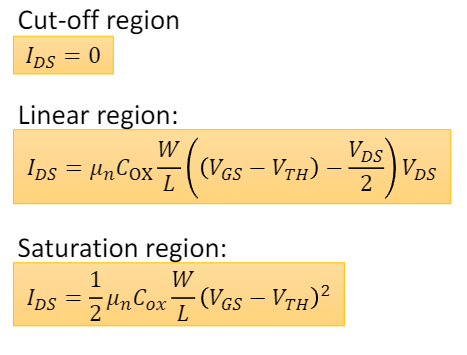
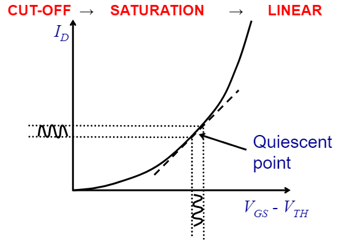
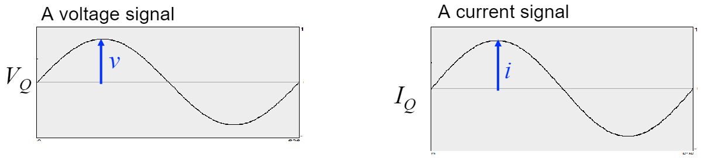
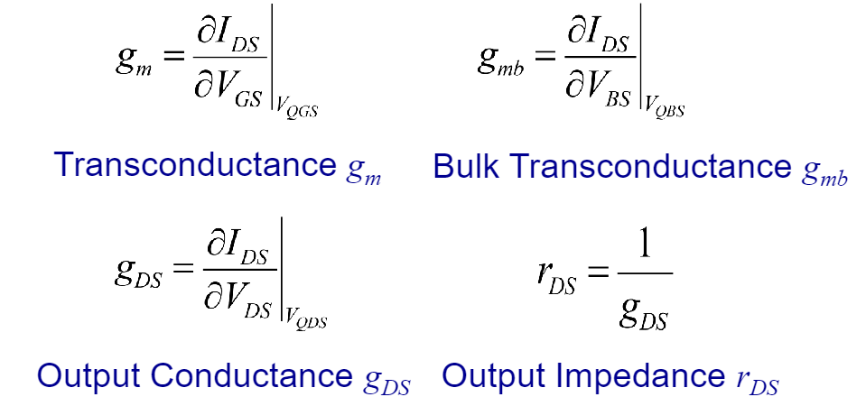
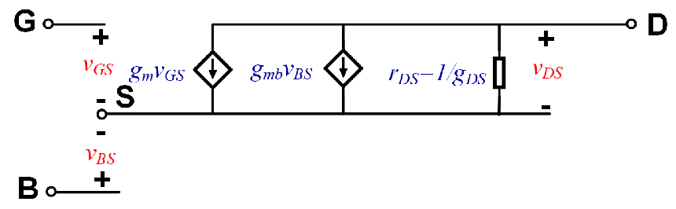
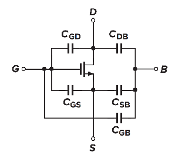
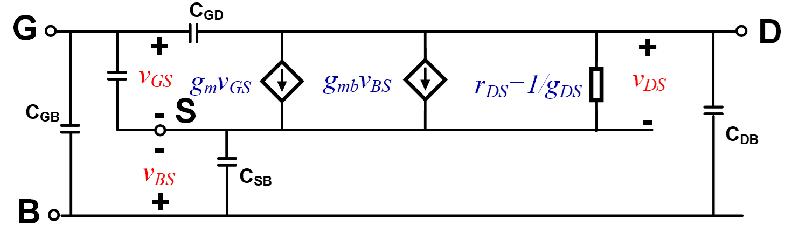

# MOSFET Small Signal Model

MOSFETs are nonlinear devices for large signals:

    

This nonlinear behaviour can make analysis quite difficult. Small signal analysis is thus used when one wishes to ignore a transistors non-linear behaviour. Allowing one to more simply analyse voltage/current conditions given certain bias conditions. For example, this can be useful for analysing a microphone amplifiers small audio signal response.

## Introducing Small Signal Analysis

Under small signal conditions MOSFET (and other) device characteristics are approximately linear (e.g. small-amplitude signal with fixed bias point). 

    

Small signal analysis employs this is as approximation model for simplifying calculations.

## Notation

The following shows small signal voltage and current graphs:

    

These signals can be expressed as:

$$
V = V_{Q} + v \qquad I = I_{Q} + i
$$

Here, $v$ and $i$ represent the small signal AC voltage and current respectively. $V_{Q}$ and $I_{Q}$ represent the quiescent DC bias voltage and current respectively.

## MOSFET Source as reference

In MOSFETs we treat the source terminal as the common reference, hence $V_{GS}, V_{DS}, V_{BS}, I_{GS}, I_{DS}, I_{BS}$. 

In this course (Analogue Circuits 3) only $I_{DS}$ will be considered. $I_{GS}$ and $I_{BS}$ are thus considered 0. One may however encounter/study these further at PhD level or when designing advanced CMOS technology.

The signals we are concerned with can thus be expressed as:

$$
I_{DS} = i_{DS} + I_{QDS} = f(V_{GS}, V_{DS}, V_{BS})
$$

$$
V_{GS} = v_{GS} + V_{QGS}
$$

$$
V_{DS} = v_{DS} + V_{QDS}
$$

$$
V_{BS} = v_{BS} + V_{QBS}
$$

## Small Signal Model

As shown above, $I_{DS}$ has an AC component $i_{DS}$ and a constant quiescent bias voltage $I_{QDS}$. Here, $I_{DS}$ is a function of $V_{GS}, V_{DS}$ and $V_{BS}$, each with a DC component. These DC voltage components contribute to the constant current bias current and thus must be kept constant as to analyse the AC signal $i_{DS}$. 

We thus linearise $i_{DS}$ by defining it as a linear sum of the small signal AC voltage components ($v_{GS}, v_{DS}$ and $v_{BS}$). These components have must be modified by a proportionality factor corresponding to their respective gradients. The model can thus be expressed as:

$$
i_{DS} = \frac{\partial I_{DS}}{\partial V_{GS}} \Big\vert_{V_{QGS}} v_{GS} + \frac{\partial I_{DS}}{\partial V_{DS}} \Big\vert_{V_{QDS}} v_{DS} + \frac{\partial I_{DS}}{\partial V_{BS}} \Big\vert_{V_{QBS}} v_{BS}
$$

The partial derivate terms are named/defined as follows:

    

The modelling equation can thus be rewritten as:

$$
i_{DS} = g_{m} v_{GS} + g_{DS} v_{DS} + g_{mb} v_{BS}
$$

### Equivalent Circuit

From the small signal model equation we are able to develop a equivalent circuit model. As the derivative terms in the equation show we are able to change the voltage between two terminals and measure a current change in a branch. We can therefore model this effect as a voltage dependant current source.

The gate controlled drain current variation $g_{m} V_{GS}$ is modelled as a voltage dependant current source, placed across the drain and source terminals. 

Due to channel length modulation, the drain current is also affected by the drain-source voltage. This can also be modeled as a voltage dependant current source, however, a current source linearly dependant on voltage across it is equivalent to a linear resistor. The output resistance $r_{0}$, affects the performance of many analog circuits. For example it limits the maximum voltage gain of many amplifiers.

Lastly, the bulk potential influences the threshold voltage and thus the gate source overdrive voltage. Effectively the bulk acts as a second gate terminal. This dependance can be modelled as a current source between the source and drain terminals varying as $g_{mb} V_{bs}$.

The MOSFET small signal model equivalent circuit is thus:

    

As the MOSFET current $I_{DS}$ is related to the operating region the conductances also depend on this. The small signal relationships for conductance are shown below.

## Small Signal Model - Saturation Region

### Transconductance $g_{m}$ - Saturation Region

The saturation region drain source current equation is:

$$
I_{DS} = \frac{k_{n}^{\prime}}{2} \frac{W}{L} (V_{GS} - V_{TH})^2 (1 + \lambda V_{DS})
$$

The transconductance is thus:

$$
g_{m} = \frac{\partial I_{DS}}{\partial V_{GS}} \Big\vert_{V_{QGS}} = k_{n}^{\prime} \frac{W}{L} (V_{GS} - V_{TH}) (1 + \lambda V_{DS}) = \beta (V_{GS} - V_{TH}) (1 + \lambda V_{DS})
$$

Rearranging $g_{m}$ in terms of drain current $I_{DS}$, and then disregarding channel length modulation:

$$
g_{m} = \sqrt{2\beta |I_{DS}|(1 + \lambda V_{DS})} \approx \sqrt{2\beta |I_{DS}|}
$$

### Output conductance $g_{DS}$ - Saturation Region

The saturation region drain source current equation is:

$$
I_{DS} = \frac{k_{n}^{\prime}}{2} \frac{W}{L} (V_{GS} - V_{TH})^2 (1 + \lambda V_{DS})
$$

The output conductance is thus:

$$
g_{DS} = \frac{\partial I_{DS}}{\partial V_{DS}} \Big\vert_{V_{QDS}} = \frac{k_{n}^{\prime}}{2} \frac{W}{L} (V_{GS} - V_{TH})^{2} \lambda = \frac{\lambda \beta}{2} (V_{GS} - V_{TH})^{2}
$$

Clearly this can also be written in terms of $I_{DS}$ as:

$$
g_{DS} = \frac{\lambda I_{DS}}{1 + \lambda V_{DS}}
$$

### Bulk Transconductance $g_{mb}$ - Saturation Region

The saturation region drain source current equation is:

$$
I_{DS} = \frac{k_{n}^{\prime}}{2} \frac{W}{L} (V_{GS} - V_{TH})^2 (1 + \lambda V_{DS})
$$

The equation for the bulk transconductance is:

$$
g_{mb} = \frac{\partial I_{DS}}{\partial V_{BS}} \Big\vert_{V_{QBS}}
$$

It is not immediately obvious that $I_{DS}$ is dependant on $V_{BS}$. 

Due to the [Body Effect](/Week1/IntroMOSFET.md#body-effect), the threshold voltage $V_{TH}$ is dependant on $V_{BS}$:

$$
V_{TH} = V_{TH0} + \gamma_{n}(\sqrt{\varphi_{n} + V_{SB}} - \sqrt{\varphi_{n}})
$$

Thus to compute $g_{mb}$ we must compute the partial derivative of $V_{TH}$ with respect to $V_{BS}$:

$$
\frac{\partial V_{TH}}{\partial V_{BS}} \Big\vert_{V_{QBS}} = -\frac{\partial V_{TH}}{\partial V_{SB}} \Big\vert_{V_{QBS}} = - \frac{\gamma_{n}}{2 \sqrt{\varphi_{n} + V_{SB}}}
$$

Computing the bulk transconductance:

$$
g_{mb} = \frac{\partial I_{DS}}{\partial V_{BS}} \Big\vert_{V_{QBS}} = k_{n}^{\prime} \frac{W}{L} (V_{GS} - V_{TH})(1 + \lambda V_{DS}) (-\frac{\partial V_{TH}}{\partial V_{GS}})
$$

$$
= \beta (V_{GS} - V_{TH})(1 + V_{DS}) \frac{\gamma_{n}}{2 \sqrt{\varphi_{n} + V_{SB}}}
$$

Recalling the [Saturation region transconductance $g_{m}$](#transconductance---saturation-region):

$$
g_{m} = \beta (V_{GS} - V_{TH}) (1 + \lambda V_{DS})
$$

The bulk transconductance $g_{mb}$ is thus:

$$
g_{mb} = g_{m} \frac{\gamma_{n}}{2 \sqrt{\varphi_{n} + V_{SB}}}
$$

Alternatively, this can be written as:

$$
g_{mb} = \eta g_{m}
$$

$\eta$ is a process related parameter, with a typical value $\approx 0.25$. As expected $g_{mb}$ is proportional to $\gamma$. The equation for $g_{mb}$ also shows that the body effect has a smaller effect as $V_{SB}$ increases.

## Small Signal Model - Linear Region

### Transconductance $g_{m}$ - Linear Region

The linear region drain source current equation is:

$$
I_{DS} = k_{n}^{\prime} \frac{W}{L} \left( (V_{GS} - V_{TH}) - \frac{V_{DS}}{2} \right) V_{DS} (1 + \lambda V_{DS})
$$

The transconductance is thus:

$$
g_{m} = \frac{\partial I_{DS}}{\partial V_{GS}} \Big\vert_{V_{QGS}} = k_{n}^{\prime} \frac{W}{L} V_{DS} (1 + \lambda V_{DS}) = \beta V_{DS} (1 + \lambda V_{DS})
$$

Disregarding channel length modulation:

$$
g_{m} \approx k_{n}^{\prime} \frac{W}{L} V_{DS} = \beta V_{DS}
$$

### Output conductance $g_{DS}$ - Linear Region

The linear region drain source current equation is:

$$
I_{DS} = k_{n}^{\prime} \frac{W}{L} \left( (V_{GS} - V_{TH}) - \frac{V_{DS}}{2} \right) V_{DS} (1 + \lambda V_{DS})
$$

The output conductance is thus:

$$
g_{DS} = \frac{\partial I_{DS}}{\partial V_{DS}} \Big\vert_{V_{QDS}} = k_{n}^{\prime} \frac{W}{L} (V_{GS} - V_{TH} - V_{DS}) = \beta (V_{GS} - V_{TH} - V_{DS})
$$

### Bulk Transconductance $g_{mb}$ - Linear Region

The linear region bulk transconductance derivation is essentially the same as that for the [saturation region](#bulk-transconductance---saturation-region).

The linear region bulk transconductance is:

$$
g_{mb} = \frac{\beta \gamma_{n} V_{DS}}{2 \sqrt{\phi_{n} - V_{BS}}} = \eta g_{m}
$$

## Small Signal Model - High Frequency

At high frequencies the [MOSFET parasitic capacitances](/Week2/Capacitance/MOSFET-Capacitances.md) are important to consider.

    

These capacitances ae thus included in the equivalent circuit model.

    

## Additional Reading

Design of Analog CMOS integrated circuits ($1_{st}$ and $2_{nd}$ edition) - Sections 2.4.1 to 2.4.2
